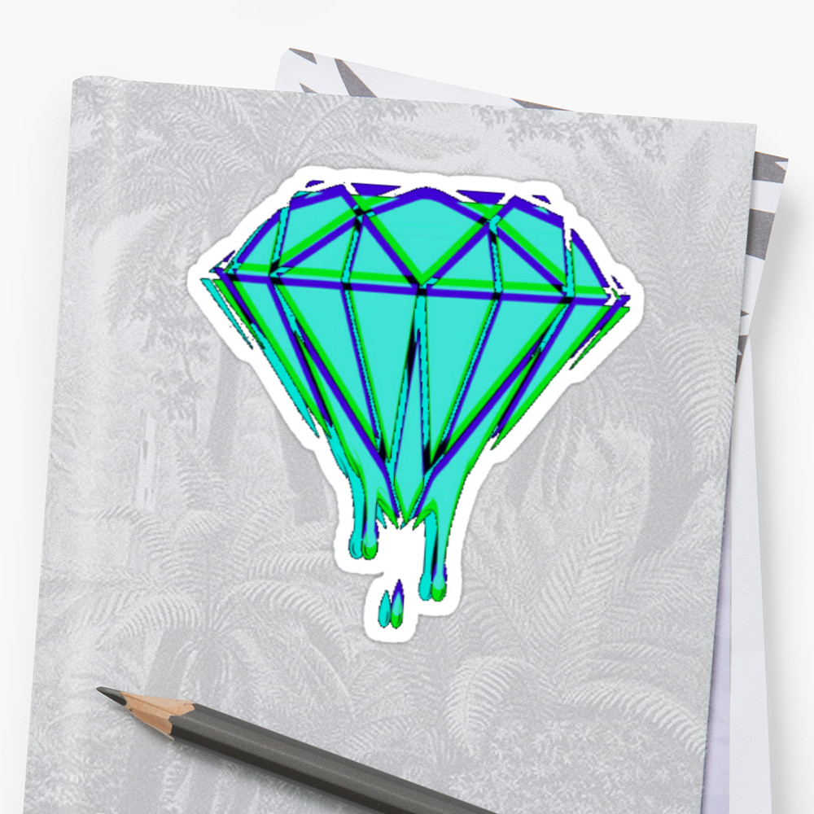

# This is the first-level header
## This is another size
### This is the third size

Writing a paragraph, just type normaly.

* Item one
* Item two
* Item three
* Item four

colum 1 | colum 2
---|---
Buffalo Bills | Awesomeness
Yankees | Swaggness
Bears | other words

